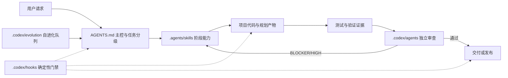

# 全栈 Codex Agent 项目结构

## 运行关系



职责边界：`AGENTS.md` 负责路由和全局边界；Skill 负责需要语义判断的阶段流程；专用 Agent 负责独立审查；Hook 只执行可机械判断的阻止、记录和提醒。

## 完整目录树

```text
fullstack-codex-agent/
├── AGENTS.md                              # 主控：角色、边界、三级任务路由、流程、自动化和完成门槛
├── PROJECT-STRUCTURE.md                   # 本文件：项目结构、调用关系和逐文件职责说明
├── TASK-STATE.md（运行时按需生成）         # 标准/严格任务的跨会话现场；完成后删除或按项目约定归档
├── .DS_Store                              # macOS Finder 元数据；无项目功能，可安全忽略
├── .agents/
│   ├── .DS_Store                          # macOS Finder 元数据；无项目功能
│   ├── skills/
│       ├── .DS_Store                      # macOS Finder 元数据；无项目功能
│       ├── scoping-fullstack-work/
│       │   ├── SKILL.md                   # 入口勘察：识别范围、受影响层、冲突、生产风险及快速/标准/严格级别
│       │   ├── agents/openai.yaml         # Codex UI 元数据：显示名、简介和默认触发提示
│       │   ├── references/stack-selection.md # 新项目技术选型的比较维度、候选与推荐规则
│       │   └── templates/stack-profile-template.md # 技术栈事实、版本来源和约束的统一记录模板
│       ├── building-product-spec/
│       │   ├── SKILL.md                   # 产品需求：把想法或重大变更整理成可验收的 Product-Spec
│       │   ├── agents/openai.yaml         # Product Spec Skill 的 Codex UI 元数据
│       │   ├── references/interview-principles.md # 需求访谈原则：控制追问方式、节奏和信息质量
│       │   ├── references/question-bank.md        # 需求问题库：按缺失维度选择问题，不要求一次全部加载
│       │   ├── templates/product-spec-template.md # Product-Spec.md 的标准输出结构
│       │   └── templates/changelog-template.md    # Product-Spec 迭代变更记录模板
│       ├── building-design-brief/
│       │   ├── SKILL.md                   # 设计简报：从产品目标生成 Design-Brief 或轻量 Visual Contract
│       │   ├── agents/openai.yaml         # Design Brief Skill 的 Codex UI 元数据
│       │   ├── references/interview-principles.md # 视觉访谈原则：把抽象审美词转换成可观察属性
│       │   ├── references/question-bank.md        # 视觉问题库：产品形态、方向、页面、状态和响应式问题
│       │   └── templates/design-brief-template.md # 完整 Design-Brief.md 输出模板
│       ├── specifying-fullstack-features/
│       │   ├── SKILL.md                   # 功能规格：定义角色、权限、页面、API、数据、失败状态和验收条件
│       │   └── agents/openai.yaml         # 功能规格 Skill 的 Codex UI 元数据
│       ├── designing-system-architecture/
│       │   ├── SKILL.md                   # 系统架构：模块边界、请求/数据流、事务、缓存、一致性和服务拆分判断
│       │   └── agents/openai.yaml         # 系统架构 Skill 的 Codex UI 元数据
│       ├── designing-frontend-ui/
│       │   ├── SKILL.md                   # 页面与视觉：形成可实现、可审查的 Visual Contract
│       │   ├── agents/openai.yaml         # 前端 UI Skill 的 Codex UI 元数据
│       │   └── references/page-patterns.md # 按需页面模式：仪表盘、表格、表单、工作台、营销页和改造策略
│       ├── designing-api-contracts/
│       │   ├── SKILL.md                   # API 契约：路由、Schema、错误码、权限、分页、并发和幂等
│       │   └── agents/openai.yaml         # API 契约 Skill 的 Codex UI 元数据
│       ├── designing-database-changes/
│       │   ├── SKILL.md                   # 数据设计：模型、约束、索引、锁、回填、兼容、备份和回滚方案
│       │   └── agents/openai.yaml         # 数据库设计 Skill 的 Codex UI 元数据
│       ├── planning-fullstack-implementation/
│       │   ├── SKILL.md                   # 实施计划：依风险级别生成短计划、Task 计划或完整 DEV-PLAN
│       │   ├── agents/openai.yaml         # 实施计划 Skill 的 Codex UI 元数据
│       │   ├── templates/dev-plan-template.md # DEV-PLAN.md 模板：依赖、Phase、文件、验收和追踪关系
│       │   └── templates/task-state-template.md # TASK-STATE.md 模板：当前任务、决定、证据、工作区和下一步
│       ├── building-frontend/
│       │   ├── SKILL.md                   # 通用前端实现：按 Stack Profile 沿用框架、组件、状态和测试模式
│       │   └── agents/openai.yaml         # 通用前端 Skill 的 Codex UI 元数据
│       ├── building-backend/
│       │   ├── SKILL.md                   # 通用后端实现：按 Stack Profile 实现入口、服务、鉴权和数据访问
│       │   └── agents/openai.yaml         # 通用后端 Skill 的 Codex UI 元数据
│       ├── migrating-database/
│       │   ├── SKILL.md                   # 通用数据迁移：使用项目既有工具验证迁移、回填和恢复
│       │   └── agents/openai.yaml         # 数据迁移 Skill 的 Codex UI 元数据
│       ├── debugging-fullstack/
│       │   ├── SKILL.md                   # 全栈调试：逐边界记录证据，定位第一个错误节点并单点修复
│       │   └── agents/openai.yaml         # 全栈调试 Skill 的 Codex UI 元数据
│       ├── testing-fullstack-changes/
│       │   ├── SKILL.md                   # 验证：按风险和受影响层运行测试、浏览器、API、数据库与 E2E 检查
│       │   └── agents/openai.yaml         # 全栈验证 Skill 的 Codex UI 元数据
│       ├── reviewing-fullstack-changes/
│       │   ├── SKILL.md                   # 审查编排：快速任务自检，标准/严格任务派发两阶段及专项 Reviewer
│       │   └── agents/openai.yaml         # 全栈审查 Skill 的 Codex UI 元数据
│       ├── deploying-fullstack/
│       │   ├── SKILL.md                   # 部署：真实产物、环境、迁移顺序、隐私扫描、健康检查和回滚
│       │   └── agents/openai.yaml         # 部署 Skill 的 Codex UI 元数据
│       ├── creating-autonomous-goals/
│       │   ├── SKILL.md                   # 自驱目标：生成带范围、证据、确认点和停止条件的目标指令
│       │   └── agents/openai.yaml         # 自驱目标 Skill 的 Codex UI 元数据
│       └── evolving-agent-rules/
│           ├── SKILL.md                   # 规则进化：把纠正信号转成待用户确认的增加/修改/合并/删除建议
│           └── agents/openai.yaml         # 规则进化 Skill 的 Codex UI 元数据
│   └── references/
│       └── nextjs-typescript.md            # 按需技术适配示例；仅 Stack Profile 匹配时读取
└── .codex/
    ├── .DS_Store                          # macOS Finder 元数据；无项目功能
    ├── hooks.json                         # Hook 注册表：把事件、匹配器和脚本连接起来
    ├── EVOLUTION.md                       # 自进化说明：信号收集、建议生成和用户确认边界
    ├── agents/
    │   ├── fullstack-reviewer.toml        # 两阶段全栈 Reviewer：先正确性，再安全、数据、测试和质量
    │   ├── visual-checker.toml            # 视觉 Reviewer：浏览器对照设计契约检查视觉、响应式和无障碍
    │   ├── migration-reviewer.toml        # 迁移 Reviewer：检查数据丢失、锁、兼容、回填和回滚风险
    │   ├── deployment-reviewer.toml       # 部署 Reviewer：检查环境、权限、迁移顺序、健康检查和回滚
    │   └── evolution-runner.toml          # 进化 Runner：消费信号并生成建议，不直接修改规则
    ├── evolution/
    │   ├── signals.jsonl                  # 用户纠正信号队列；一行一条 JSON 事件，当前为空
    │   └── proposals.md                   # 进化建议队列；保存尚待用户逐条确认的规则建议
    └── hooks/
        ├── auto-push.sh                   # 成功 commit 后仅在非保护分支且远程唯一/明确时自动 push
        ├── check-evolution.sh             # Session 启动检查信号和待审建议并提醒主 Agent 处理
        ├── detect-feedback-signal.sh      # 从用户明显纠正语句中提取信号写入 signals.jsonl
        ├── guard-dependency-additions.sh  # 阻止未批准新增依赖；允许计划明确列出的依赖
        ├── guard-git-writes.sh            # 阻止未授权 commit、push、merge 和 rebase
        ├── guard-production-operations.sh # 阻止未单独确认的部署、云资源和生产数据库写操作
        ├── guard-secrets.sh               # 阻止疑似私钥、生产 Key 和明文数据库凭据进入命令或文件
        ├── manage-dev-server.sh           # 启动前只清理已记录且可证明属于当前项目的开发进程
        ├── mark-verification-needed.sh    # 代码、Schema、迁移或部署文件修改后标记需要验证
        ├── record-verification.sh         # 记录 typecheck、lint、build、测试、迁移和安全检查结果
        └── require-verification.sh        # Stop 门禁：存在未完成验证标记时阻止任务结束
```

## Skill 调用链

```text
所有请求
  → scoping-fullstack-work
  → 快速：短计划 → 实现 → 定向验证 → 主 Agent 自检
  → 标准：验收契约 → 必要设计/API/数据决策 → Task 计划 → 实现 → 验证 → 两阶段审查
  → 严格：Product-Spec → Design-Brief（有 UI）→ 架构/API/数据契约
          → DEV-PLAN → 分阶段实现/迁移 → 完整验证 → 专项审查 → 部署准备

横切流程
  Bug      → debugging-fullstack → testing-fullstack-changes → reviewing-fullstack-changes
  UI       → designing-frontend-ui → visual-checker
  Migration→ migrating-database → migration-reviewer
  Deploy   → deploying-fullstack → deployment-reviewer
  Correction → detect-feedback-signal → evolution-runner → 用户确认 → 更新规则

跨会话恢复
  标准/严格任务 → TASK-STATE.md → SessionStart 提醒 → 校验原文/Git/验证/运行时 → 恢复当前 Task
```

## 文件类型说明

| 类型 | 谁读取/执行 | 作用 |
|---|---|---|
| `AGENTS.md` | 主 Agent | 全局规则、边界和路由入口 |
| `SKILL.md` | 命中阶段的主 Agent | 需要上下文判断的专业流程 |
| `agents/openai.yaml` | Codex UI/Skill 发现系统 | Skill 展示名称、简介和默认提示 |
| `references/*.md` | Skill 按需读取 | 较长问题库和领域模式，避免每次消耗 Token |
| `templates/*.md` | 对应 Skill | 生成标准化 Product-Spec、Design-Brief、DEV-PLAN 等产物 |
| `.codex/agents/*.toml` | 主 Agent 派发的专用 Agent | 独立、只读的专项审查或建议生成 |
| `.codex/hooks.json` | Codex Hook 运行时 | 注册事件与脚本 |
| `.codex/hooks/*.sh` | Hook 运行时 | 执行确定性保护、记录和提醒 |
| `.codex/evolution/*` | Hook、evolution-runner、主 Agent | 保存纠正信号及待确认建议 |
| `.DS_Store` | macOS Finder | 与 Agent 无关，发布或复制模板时可排除 |
