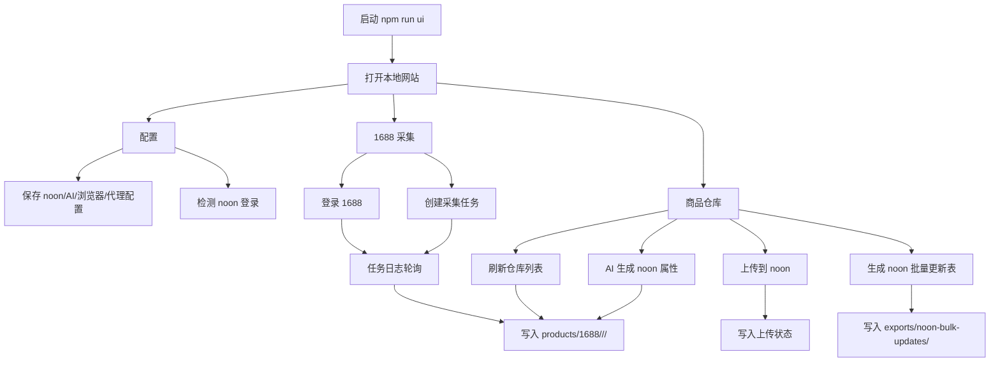
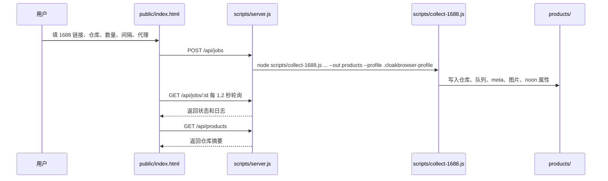
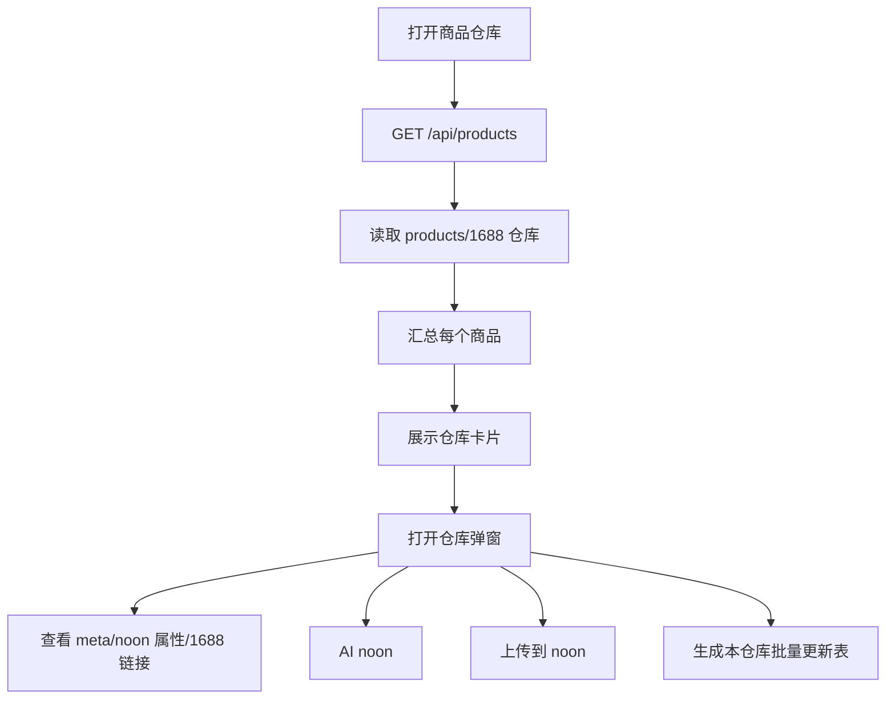
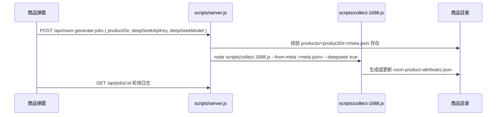
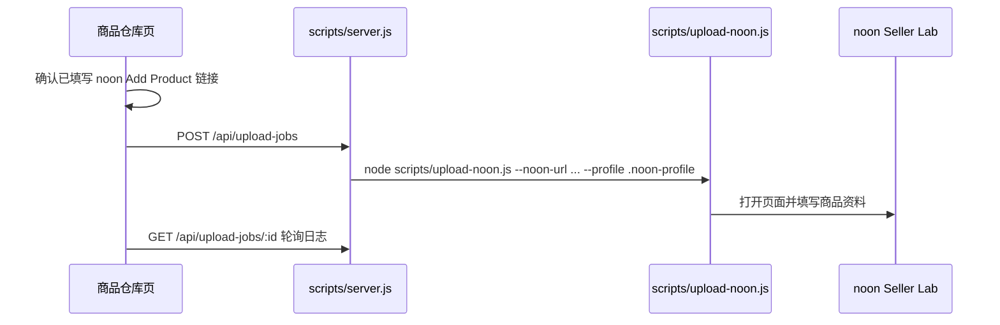
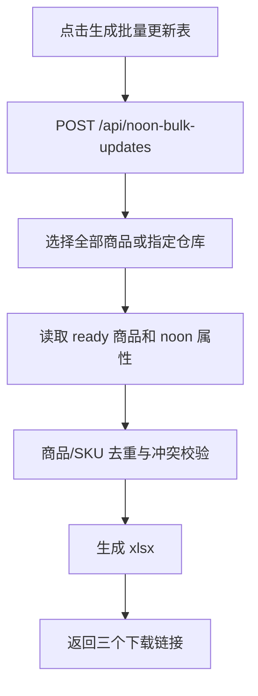
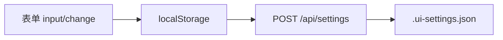
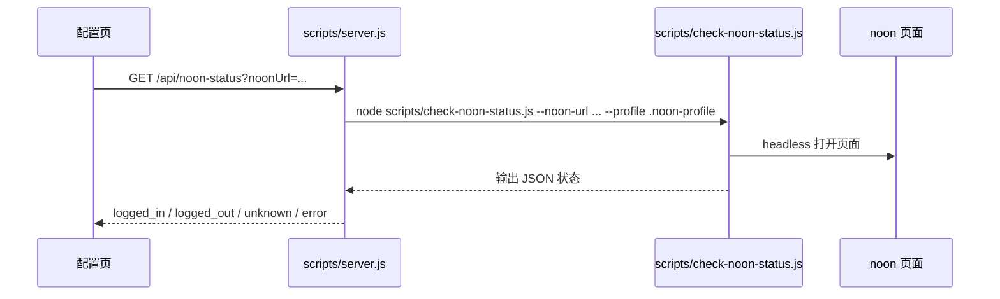

# 网站功能流程

## 范围

本文记录当前本地网站 `public/index.html` 与 `scripts/server.js` 已实现的功能流程。

假设：

- 网站通过 `npm run ui` 启动，默认地址是 `http://localhost:4173`。
- 浏览器直接打开 `public/index.html` 时只能看页面，不能执行采集、上传、检测和导出。
- 商品主数据在本机 `products/` 下，导出文件在 `exports/` 下，配置保存在 `.ui-settings.json`。

## 总流程



## 页面入口

| 页面 | 入口 | 主要用途 |
| --- | --- | --- |
| 工作台 | `#dashboard` | 展示仓库数、商品目录数、图片数，提供快速跳转 |
| 1688 采集 | `#collect` | 登录 1688、填写采集链接、创建采集任务、查看采集日志 |
| 商品仓库 | `#repositories` | 查看仓库和商品，执行 AI noon、上传 noon、生成批量更新表 |
| 配置 | `#settings` | 保存 1688/noon/DeepSeek 配置，检测 noon 登录状态 |

## API 与后端动作

| 前端动作 | API | 后端动作 | 主要产物 |
| --- | --- | --- | --- |
| 读取配置 | `GET /api/settings` | 读取 `.ui-settings.json` | 表单默认值 |
| 保存配置 | `POST /api/settings` | 过滤允许字段后写入 `.ui-settings.json` | 本机 UI 配置 |
| 开始采集 | `POST /api/jobs` | 启动 `scripts/collect-1688.js` | `products/1688/.../meta.json`、图片、`noon-product-attributes.json` |
| 停止采集/生成任务 | `POST /api/jobs/:id/cancel` | 终止对应子进程 | job 状态变为 `cancelled` |
| 查询采集/生成任务 | `GET /api/jobs`、`GET /api/jobs/:id` | 返回内存中的 job 状态和最近日志 | 页面日志 |
| 登录 1688 | `POST /api/login-1688` | 启动 `scripts/login-1688.js` | `.cloakbrowser-profile` 登录态 |
| AI 生成 noon 属性 | `POST /api/noon-generate-jobs` | 用商品 `meta.json` 启动 `scripts/collect-1688.js --from-meta --deepseek true` | `noon-product-attributes.json` |
| 上传 noon | `POST /api/upload-jobs` | 启动 `scripts/upload-noon.js` | noon 页面录入结果、本地上传状态 |
| 停止上传任务 | `POST /api/upload-jobs/:id/cancel` | 终止上传子进程 | upload job 状态变为 `cancelled` |
| 查询上传任务 | `GET /api/upload-jobs`、`GET /api/upload-jobs/:id` | 返回内存中的 upload job 状态和最近日志 | 页面日志 |
| 检测 noon 登录 | `GET /api/noon-status?noonUrl=...` | 启动 `scripts/check-noon-status.js` 只读打开 noon 页面 | 登录状态、最终 URL、页面标题 |
| 查询商品仓库 | `GET /api/products` | 读取 `products/1688` 仓库与商品摘要 | 仓库卡片、商品弹窗 |
| 生成批量更新表 | `POST /api/noon-bulk-updates` | 调用 `exportNoonBulkUpdates` | 三个 xlsx 下载链接 |
| 读取商品文件 | `GET /products/...` | 静态返回 `products/` 内文件 | `meta.json`、noon 属性、图片 |
| 读取导出文件 | `GET /exports/...` | 静态返回 `exports/` 内文件 | xlsx 下载 |

## 1688 采集流程



规则：

- 1688 链接必须是 `http(s)://...1688.com/...`。
- 采集任务和 1688 登录任务共用 `jobs`，同一时间只允许一个 1688 相关任务运行。
- 单商品默认写入 `products/1688/default/<productId>/`。
- 列表采集按仓库写入 `products/1688/<repository>/<productId>/`。

## 商品仓库流程



仓库摘要来自：

- `repository.json`: 仓库 ID、名称、平台、类型。
- `meta.json`: 商品标题、来源链接、图片数量、采集警告。
- `noon-product-attributes.json`: noon 标题、SKU 数量、图片数量、提交检查状态。
- 上传状态文件：用于显示 `not_uploaded` 等上传状态。

## AI 生成 noon 属性流程



## noon 上传流程



上传入口有两种：

- 单商品上传：传 `productDir`，后端转换为 `--product-dir products/<productDir>`。
- 全部上传：传 `all: true`，后端使用 `--all`。

上传参数来自配置页：

- `noonUrl`: noon Add Product 链接，必填。
- `noonBrowser`: `chrome` 或 `cloak`。
- `noonCloakTyping`: CloakBrowser 是否逐字输入。
- `noonHeadless`: 是否后台运行。

## noon 批量更新表流程



输出目录：

```text
exports/noon-bulk-updates/<timestamp>-all/
exports/noon-bulk-updates/<timestamp>-<repository>/
```

输出文件：

- `global-product-update.xlsx`
- `global-price-update.xlsx`
- `stock-import.xlsx`

## 配置与登录检测流程

配置保存流程：



noon 检测流程：



## 本地文件职责

| 路径 | 职责 |
| --- | --- |
| `public/index.html` | 单页 UI、导航、表单、轮询、日志渲染 |
| `scripts/server.js` | 本地 HTTP 服务、API 路由、任务调度、静态文件读取 |
| `.ui-settings.json` | 本机 UI 配置 |
| `.cloakbrowser-profile` | 1688 登录浏览器资料 |
| `.noon-profile` | noon 登录浏览器资料 |
| `products/1688/<repository>/<productId>/meta.json` | 1688 来源事实和本地素材事实 |
| `products/1688/<repository>/<productId>/noon-product-attributes.json` | noon 目标商品数据 |
| `products/1688/<repository>/repository.json` | 仓库元数据 |
| `products/1688/<repository>/collection-queue.json` | 批量采集队列 |
| `products/1688/<repository>/index.json` | 仓库派生索引 |
| `products/1688/index.json` | 平台派生索引 |
| `exports/noon-bulk-updates/` | noon 批量更新表 |

## 成功标准

- `npm run ui` 后能打开 `http://localhost:4173`。
- 工作台能通过 `GET /api/products` 展示仓库、商品和图片数量。
- 1688 采集任务能在页面看到日志，并在结束后刷新仓库。
- 商品弹窗能打开 `meta.json`、`noon-product-attributes.json` 和来源链接。
- AI noon、上传 noon、批量更新表都从商品仓库页发起，并能在仓库日志区看到结果。
- 批量更新表生成后页面返回三个 xlsx 下载链接。
